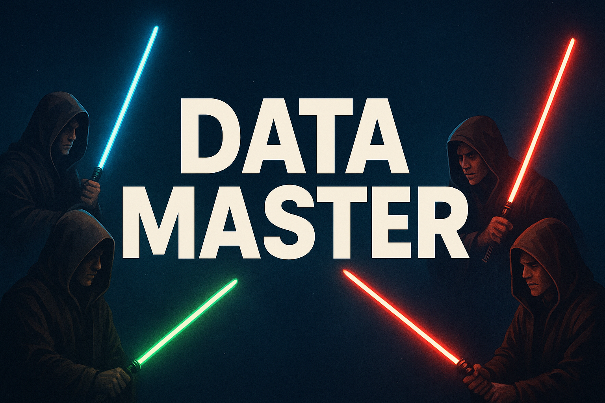

# Data Master - Kariman Gomes

&nbsp;

  

&nbsp;

O repositório "DataMaster-DataEngineer-Kariman" apresenta a solução de Engenharia de Dados criada por [Kariman](https://www.linkedin.com/in/kariman-gomes/) como parte do programa Data Master, uma iniciativa da F1rst Santander. 

&nbsp;
1. [Objetivo do Projeto]()
   - [Início Rápido]()

2. [Arquitetura de Solução]()
   - [Visão Geral]()
   - [Diagrama da Arquitetura de Solução]()
   - [Componentes Principais]()
   - [Características Essenciais do Projeto]()

3. [Arquitetura Técnica]()
   - [Visão Geral Técnica]()
   - [Descrição do Fluxo de Dados]()
   - [Modelagem e Estrutura do Data Lake]()
   - [Tecnologias e Serviços Utilizados]()
   - [Infraestrutura como Código]()
   - [Orquestração de Pipelines]()
   - [Extração e Ingestão de Dados]()
   - [Armazenamento de Dados]()
   - [Processamento e Transformação dos Dados]()
   - [Qualidade e Validação de Dados]()
   - [Mascaramento e Segurança dos Dados]()
   - [Observabilidade e Monitoramento]()
   - [Escalabilidade e Desempenho]()

4. [Guia de Configuração e Execução]()
   - [Pré-requisitos]()
   - [Configuração da Infraestrutura]()
   - [Configuração de Credenciais e Acessos]()
   - [Execução dos Pipelines de Ingestão]()
   - [Execução dos Pipelines de Transformação]()
   - [Execução da Integração com o CRM]()

5. [Melhorias e Considerações Finais]()
   - [Melhorias Futuras]()
   - [Considerações Finais]()

6. [Custos do Projeto]()

7. [Referências]()

&nbsp;

## 1. Objetivo do Projeto

### 1.1 Início Rápido

## 2. Arquitetura de Solução

### 2.1 Visão Geral
### 2.2 Diagrama da Arquitetura de Solução
### 2.3 Componentes Principais
### 2.4 Características Essenciais do Projeto

## 3. Arquitetura Técnica

### 3.1 Visão Geral Técnica
### 3.2 Descrição do Fluxo de Dados
### 3.3 Modelagem e Estrutura do Data Lake
### 3.4 Tecnologias e Serviços Utilizados
### 3.5 Infraestrutura como Código
### 3.6 Orquestração de Pipelines
### 3.7 Extração e Ingestão de Dados
### 3.8 Armazenamento de Dados
### 3.9 Processamento e Transformação dos Dados
### 3.10 Qualidade e Validação de Dados
### 3.11 Mascaramento e Segurança dos Dados
### 3.12 Observabilidade e Monitoramento
### 3.13 Escalabilidade e Desempenho

## 4. Guia de Configuração e Execução

### 4.1 Pré-requisitos
### 4.2 Configuração da Infraestrutura
### 4.3 Configuração de Credenciais e Acessos
### 4.4 Execução dos Pipelines de Ingestão
### 4.5 Execução dos Pipelines de Transformação
### 4.6 Execução da Integração com o CRM

## 5. Melhorias e Considerações Finais

### 5.1 Melhorias Futuras
### 5.2 Considerações Finais

## 6. Custos do Projeto

## 7. Referências